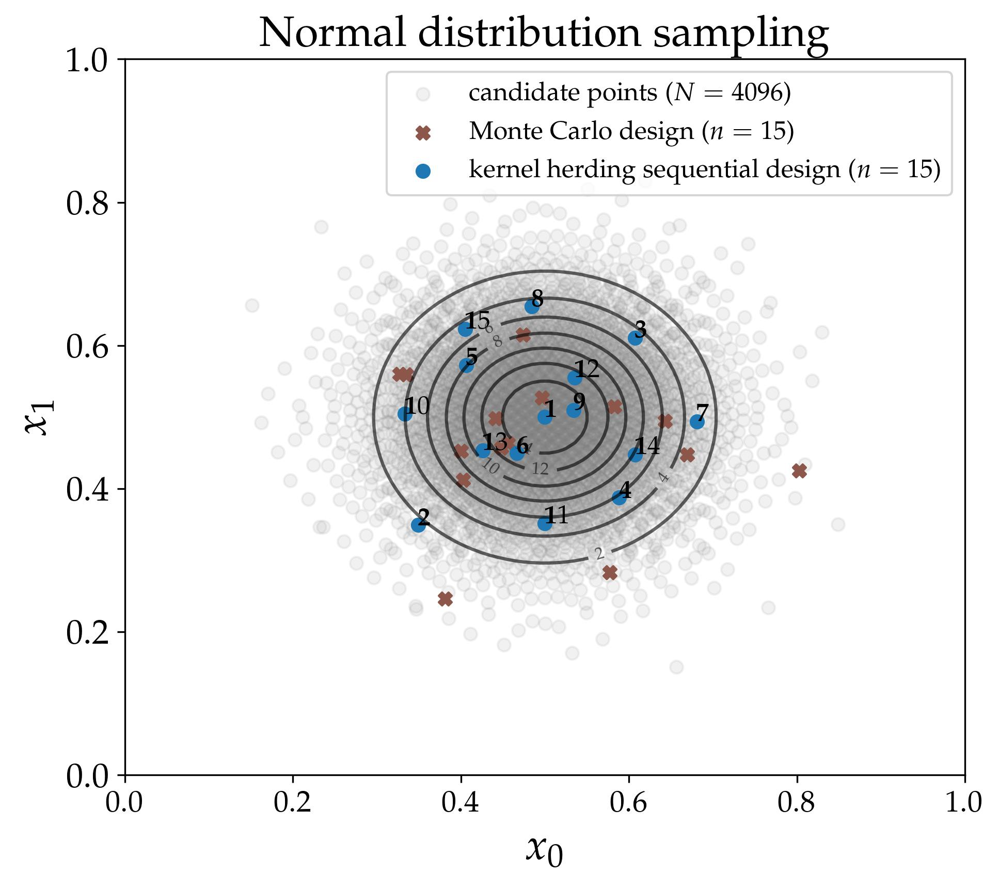

# otkerneldesign

This Python module generates designs of experiments based on kernel methods such as Kernel Herding and Support Points with the classes:
- KernelHerding
- KernelHerdingTensorized
- GreedySupportPoints

Additionally, optimal weights for quadrature and validation designs are provided by the classes:

- BayesianQuadratureWeighting
- TestSetWeighting

## Installation

```bash
~$ pip install otkerneldesign
```

## Documentation & references

- [Package documentation](https://efekhari27.github.io/otkerneldesign/master/index.html)
- [Usage in Machine Learning model validation](https://hal.archives-ouvertes.fr/hal-03523695v2/document)
- [Support points](https://projecteuclid.org/journals/annals-of-statistics/volume-46/issue-6A/Support-points/10.1214/17-AOS1629.full)
- [Kernel herding](https://arxiv.org/abs/1203.3472)

## Example

```python
>>> import openturns as ot
>>> import otkerneldesign as otkd
>>> # Distribution definition
>>> distribution = ot.ComposedDistribution([ot.Normal(0.5, 0.1)] * 2)
>>> dimension = distribution.getDimension()
>>> # Kernel definition
>>> ker_list = [ot.MaternModel([0.1], [1.0], 2.5)] * dimension
>>> kernel = ot.ProductCovarianceModel(ker_list)
>>> # Kernel herding design
>>> kh = otkd.KernelHerding(kernel=kernel, distribution=distribution)
>>> kh_design, kh_indices = kh.select_design(size=20)
```


## Authors

- Elias Fekhari
- Joseph Muré

