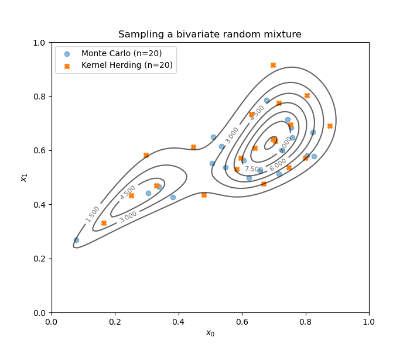

.. otkerneldesign documentation master file, created by
   sphinx-quickstart on Mon Feb 14 09:17:40 2022.
   You can adapt this file completely to your liking, but it should at least
   contain the root `toctree` directive.

Documentation
=============
 
This Python module generates designs of experiments based on kernel methods such as kernel herding and support points.
Additionally, the :class:`~otkerneldesign.TestSetWeighting` provides a new estimator for validation designs.

Theory
------

.. toctree::
   :maxdepth: 1
   
   theory/theory

User documentation
------------------

.. toctree::
   :maxdepth: 2
   
   user_manual/user_manual

Examples 
--------

.. toctree::
   :maxdepth: 2
   
   examples/examples

References
----------
- Chen, Y., M. Welling, & A. Smola (2010). Super-samples from kernel herding. In Proceedings of the Twenty-Sixth
  Conference on Uncertainty in Artificial Intelligence, pp. 109 – 116.
- Mak, S. & V. R. Joseph (2018). Support points. The Annals of Statistics 46, 2562 – 2592.
- Fekhari, E., B. Iooss, J. Mure, L. Pronzato, & M. Rendas (2022). Model predictivity assessment: incremental
  test-set selection and accuracy evaluation. preprint.
- Briol, F.-X., C. Oates, M. Girolami, M. Osborne, & D. Sejdinovic (2019). Probabilistic Integration: A Role in
  Statistical Computation? Statistical Science 34, 1 – 22.
- Huszár, F. & D. Duvenaud (2012). Optimally-Weighted Herding is Bayesian Quadrature. In Proceedings of the
  Twenty-Eighth Conference on Uncertainty in Artificial Intelligence, pp. 377 – 386.
- Teymur, O., J. Gorham, M. Riabiz, & C. Oates (2021). Optimal quantisation of probability measures using 
  maximum mean discrepancy. In International Conference on Artificial Intelligence and Statistics, pp. 1027 – 1035.

